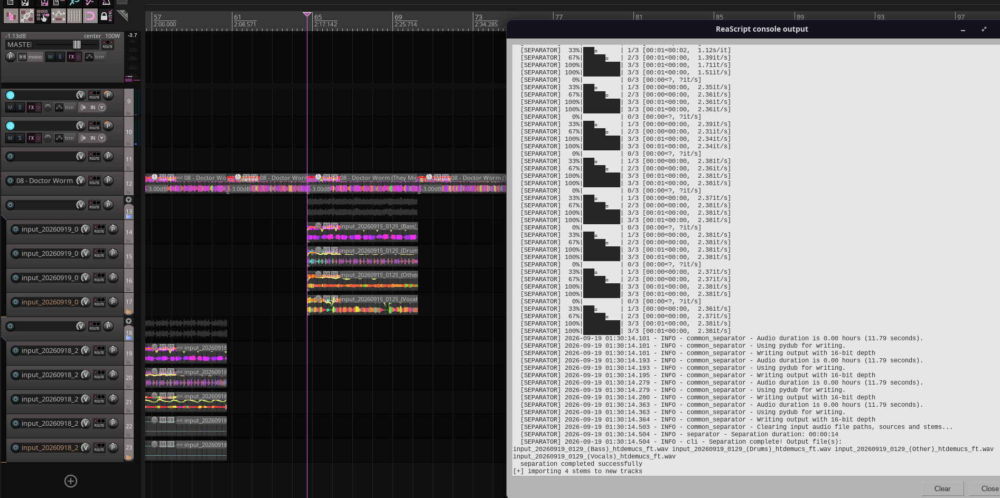

# Reaper Audio Separator



[](https://www.gnu.org/licenses/agpl-3.0)
[](https://www.python.org/downloads/)

A minimal and powerful Python Audio Separator script for Reaper, designed to split audio stems directly within your DAW using state-of-art AI models.

> **⚠️ A note for Windows users**  
> This script was developed and tested primarily on **Linux** (Arch Linux). While it may work on Windows, functionality is currently limited and untested on Windows platforms.

### How It Works

This script is essentially a bridge between Reaper and [python-audio-separator](https://github.com/nomadkaraoke/python-audio-separator), a Python package made for stem separation, de-noise, de-reverb/echo and de-bleeding. Python Audio Separator provides the latest state-of-the-art models for audio processing.

- Before the inference, [FFmpeg](https://github.com/FFmpeg/FFmpeg) renders a lossless version of the original audio file that **matches the duration and offset** of your selected item
- Reaper Audio Separator will run the **processed take** into the `python-audio-separator` using the preset of your choice (btw, you can make your own presets!)
- After the inference, the script organizes the stems inside of your project directory, following this structure: `./Media/stems/{item_name}/{date}_input(stem_type).wav`
- The newly generated stems are immediately inserted into new tracks inside your project.

This is a completely non-destructive process that happens without leaving your DAW.

### Additional Info

Reaper Audio Separator will strictly remain as a simple script. Evolving it into a Reaper Extension would require coding a complex GUI, multiple files, excessive lines of code, implementing C++ and etc... A Python script is the most de-bloated form to implement `python-audio-separator` into Reaper, without compromising the user experience.

**Contributions are appreciated!** Especially for:

- Windows compatibility fixes
- Additional preset configurations
- Performance optimizations
- Bug fixes and error handling

---

## Prerequisites

- **Reaper 6.0+**
- **Python 3.12** (recommended) or Python 3.10+
- **FFmpeg** installed on your system

## Installation

### 1. Clone the Repository

Open your terminal and clone the repository inside the `REAPER/Scripts` directory, or to your desired location:

```sh
# optional
cd ~/.config/REAPER/Scripts/ # this directory may be different for your operating system

git clone https://github.com/kaii909/reaper-audio-separator
cd reaper-audio-separator
```

### 2. Set Up a Python Environment

Create a virtual environment inside the cloned directory:

```sh
# create virtual environment
python3.12 -m venv .venv # if you don't have python 3.12, install or run a different version (not recommended)

# activate the virtual environment
source .venv/bin/activate

# upgrade pip
pip install --upgrade pip

# install the requirements
pip install -r requirements.txt
```

> **Note:** The first installation may take several minutes as it downloads PyTorch and other ML dependencies.

### 3. Verify Installation

Ensure `audio-separator` binary exists:

```sh
ls -la .venv/bin/audio-separator
```

If it exists, you're ready to go!

## Updating

```sh
# inside the cloned repository directory:
git pull
```

## Usage in Reaper

### Loading the Script

1. **Open Reaper** and navigate to your project
2. Go to **Actions** → **Show action list** (or press `?`)
3. Click **New action...** button
4. **Load ReaScript...**
5. Navigate to your cloned repository folder
6. Choose `reaper-audio-separator.py`

Assign a shortcut to the script if you want.

### Running the Script

1. **Select the audio item** you want to split in the Reaper timeline
2. Press your shortcut to the action or find the script in the action list
3. A dialog will appear asking you to choose a preset
4. See the available presets in the console
5. Type the number of your desired preset and proceed.

The script will:

- Export the selected item to WAV
- Run the AI separation model
- Import the separated stems as new tracks
- Organize everything in your project's Media/stems folder


> **Processing Time**: Expect 30 seconds to 5+ minutes depending on:
> - Length of the audio
> - Model complexity
> - Your CPU/GPU capabilities
> - RAM availability

## Available Presets

The script comes with pre-configured presets:

| ID  | Name               | Model                             | Output                               |
| --- | ------------------ | --------------------------------- | ------------------------------------ |
| 1   | Standard Stems     | htdemucs_ft.yaml                  | 4 stems (vocals, drums, bass, other) |
| 2   | Lightweight Vocals | 5_HP-Karaoke-UVR.pth              | 2 stems (vocals, instrumental)       |
| 3   | Lite De-noise      | UVR-DeNoise-Lite.pth              | Clean audio                          |
| 4   | De-reverb          | UVR-DeEcho-DeReverb.pth           | Dry audio                            |
| 5   | State-of-Art Stems | BS-Roformer-SW.ckpt               | 6 stems (highest quality)            |
| 6   | Advanced De-reverb | dereverb-echo_mel_band_roformer   | State-of-Art                         |
| 7   | Advanced De-noise  | mel_band_roformer_denoise_debleed | State-of-Art                         |

## Creating Custom Presets

To see all available models, run inside your cloned repository:

```bash
source .venv/bin/activate
audio-separator -l
```

This will display all models compatible with audio-separator.

### Edit the Script

1. Open `reaper-audio-separator.py` in a text editor
2. Locate the `PRESETS` dictionary (around line 20)
3. Add your custom preset:

```python
PRESETS = {
    "1": {"name": "standard stems (4)", "model": "htdemucs_ft.yaml"},
    "2": {"name": "vocals", "model": "5_HP-Karaoke-UVR.pth"},
    # Add your custom preset below:
    "8": {"name": "my custom model", "model": "your_model_name.pth"},
}
```

4. Save the file
5. Reload the script in Reaper

## Known Issues

### Reaper Freezes During Processing

**Problem:** Reaper becomes unresponsive or shows "Not Responding" during stem separation.

**This is normal!** The neural models require significant CPU/GPU resources, and currently i couldn't find any workaround for this. Just wait for the inference and monitor the processes through a system monitoring tool - like `btop` or task manager - if you want.

### No Audio After Import

**Problem:** Stems are imported but no waveform appears or audio is silent.

**Solutions:**

1. **Check inside Media/stems:** Ensure stems were actually created in the output folder
2. **Check Reaper console:** Look for error messages in the console window
3. **Verify FFmpeg:** Run `ffmpeg -version` in terminal to ensure it's installed
4. **Check permissions:** Ensure Reaper has read/write access to the project folder
5. **Report a new issue** inside GitHub providing your console log.

### "audio-separator not found" Error

**Problem:** Script fails with FileNotFoundError.

**Solution:**

```bash
# Activate virtual environment
source .venv/bin/activate

# Verify installation
which audio-separator

# If not found, reinstall
pip install --force-reinstall audio-separator
```

### Out of Memory (OOM) Errors

**Problem:** Script crashes with memory errors on long files.

**Solutions:**

1. **Split long files** into smaller chunks (<5 minutes)
2. **Close other applications** to free RAM
3. **Use lighter models** (avoid BS-Roformer for long files)
4. **Add swap space** (Linux):
   ```bash
   sudo fallocate -l 8G /swapfile
   sudo chmod 600 /swapfile
   sudo mkswap /swapfile
   sudo swapon /swapfile
   ```

### Poor Separation Quality

**Problem:** Stems sound muddy or artifacts are present.

**Solutions:**

1. **Try different models** - Some work better for specific genres
2. **Check source quality** - Low bitrate MP3s won't separate well
3. **Use state-of-the-art models** (preset 5, 6, or 7) for best quality

### Stems Not Aligned

**Problem:** Separated stems don't align with the original item position.

> ⚠️ Stems **will probably** be misaligned if:
>
> - Your item contains stretch markers
> - Your project tempo is automated
> - Your project rate is automated
> - Your item rate isn't 1.0

**Solution:**

**Glue** or **render** the item you're trying to separate into stems.

## Advanced Configuration

The script can be easily modified and all changes take action immediately after saving.

### Changing Sample Rate

Edit the `get_project_sample_rate()` function in the script to force a specific sample rate.

> ⚠️ Some models support 44.1kHz better or won't support any other sample rate

### Custom Output Directory

Modify the `get_output_dir()` function to change where stems are saved.

### Adjusting Processing Timeout

The script has no timeout by default. To add one, modify the `subprocess.run()` call in `run_separator()`:

```python
result = subprocess.run(
    cmd,
    capture_output=True,
    text=True,
    timeout=300,  # 5 minutes timeout
    check=False,
)
```

## Support

For issues, questions, or suggestions:

- Open an issue or pull-request on [GitHub](https://github.com/yourusername/reaper-audio-separator/issues)
- Send an e-mail or contact me (see my GitHub profile page)
